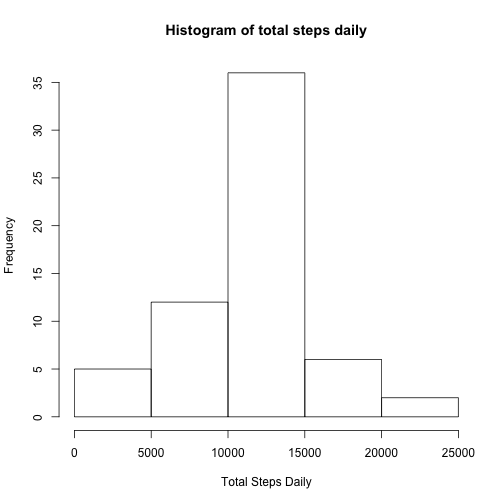
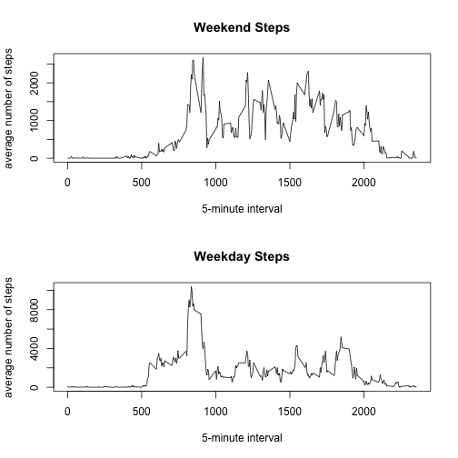

## Loading and preprocessing the data

1. Load the data

```r
url <- "https://d396qusza40orc.cloudfront.net/repdata%2Fdata%2Factivity.zip"
filename <- "activity.zip"
unzippedFilename <- "activity.csv"
if (!file.exists(filename)) {
  download.file(url, destfile = filename)
}
if (!file.exists(unzippedFilename)) {
  unzip(filename)
}
activityData <- read.csv(unzippedFilename)
```

2. Process / transform the data

```r
dailySum <- aggregate(activityData$steps, by = list(activityData$date), FUN = sum, na.rm = TRUE)
intervalSum <- aggregate(activityData$steps, by = list(activityData$interval), FUN = sum, na.rm = TRUE)
```

## What is mean total number of steps taken per day?

1. Histogram of total steps each day

```r
hist(dailySum$x, main="Histogram of total steps daily", xlab="Total Steps Daily", ylab="Frequency")
```


2. Calculate mean and median total number of steps taken per day

```r
mean(dailySum$x, na.rm = TRUE)
```

```
## [1] 9354.23
```

```r
median(dailySum$x, na.rm = TRUE)
```

```
## [1] 10395
```

## What is the average daily activity pattern?

1. Time series plot of the 5-minute interval and the average number of steps taken, averaged across all days

```r
plot(intervalSum$Group.1, intervalSum$x, type="l", xlab="5-minute interval", ylab="average number of steps")
```


2. Which 5-minute interval, on average, contains the maximum number of steps?

```r
maxIndex <- which.max(intervalSum$x)
intervalSum$Group.1[maxIndex]
```

```
## [1] 835
```

## Imputing missing values

1. Calculate the total number of missing values

```r
sum(is.na(activityData$steps))
```

```
## [1] 2304
```

2. Devise a strategy for filling in all of the missing values in the dataset.  
There isn't any data for 2012-10-01, so let's use the mean per interval instead of mean per day or surrounding data.  Proof that 2012-10-01 has no data:

```r
head(aggregate(activityData$steps, by = list(activityData$date), FUN = mean, na.rm = TRUE))
```

```
##      Group.1        x
## 1 2012-10-01      NaN
## 2 2012-10-02  0.43750
## 3 2012-10-03 39.41667
## 4 2012-10-04 42.06944
## 5 2012-10-05 46.15972
## 6 2012-10-06 53.54167
```

3. Create a new dataset that is equal to the original dataset but with the missing data filled in.

```r
intervalMean <- aggregate(activityData$steps, by = list(activityData$interval), FUN = mean, na.rm = TRUE)
assign("imputeData", activityData)
imputeData$steps <- ifelse(!is.na(imputeData$steps), imputeData$steps, intervalMean$x[match(imputeData$interval, intervalMean$Group.1)])
```

4. Make a histogram of the total number of steps taken each day and calculate and report the mean and median total number of steps taken per day. Do these values differ from the estimates from the first part of the assignment? What is the impact of imputing missing data on the estimates of the total daily number of steps?

```r
imputeDailySum <- aggregate(imputeData$steps, by = list(imputeData$date), FUN = sum, na.rm = TRUE)
hist(imputeDailySum$x, main="Histogram of total steps daily", xlab="Total Steps Daily", ylab="Frequency")
```



```r
mean(imputeDailySum$x)
```

```
## [1] 10766.19
```

```r
median(imputeDailySum$x)
```

```
## [1] 10766.19
```
The new data results in the data set following a much more normal distribution.

## Are there differences in activity patterns between weekdays and weekends?

1. Create a new factor variable in the dataset with two levels -- "weekday" and "weekend" indicating whether a given date is a weekday or weekend day.

```r
assign("weekData", imputeData)
weekend=list("Saturday","Sunday")
weekData$weekend <- ifelse(weekdays(as.POSIXlt(imputeData$date)) %in% weekend, "weekend", "weekday")
```

2. Make a panel plot containing a time series plot (i.e. type = "l") of the 5-minute interval (x-axis) and the average number of steps taken, averaged across all weekday days or weekend days (y-axis).

```r
weekendData <- weekData[weekData$weekend == "weekend",]
weekdayData <- weekData[weekData$weekend == "weekday",]

par(mfrow=c(2,1))

weekendSum <- aggregate(weekendData$steps, by = list(weekendData$interval), FUN = sum, na.rm = TRUE)
plot(weekendSum$Group.1, weekendSum$x, type = "l", xlab = "5-minute interval", ylab = "average number of steps", main="Weekend Steps")

weekdaySum <- aggregate(weekdayData$steps, by = list(weekdayData$interval), FUN = sum, na.rm = TRUE)
plot(weekdaySum$Group.1, weekdaySum$x, type = "l", xlab = "5-minute interval", ylab = "average number of steps", main = "Weekday Steps")
```


